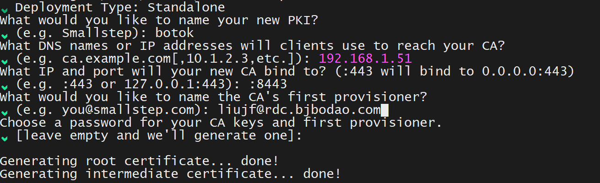

# 数据银行平台

# 说明

1、本程序为使用 FastApi 创建数据银行对我服务接口，接口认证方式为 Token 认证，支持根据 token 的接口调用频率控制，默认用户接口调用频率为 600 次/分钟。

2、数据银行平台默认包含以下功能域：
* 与内部PKI服务交互封装：包含证书申请，证书查询，证书吊销，证书验证，以及数字证书LDAP存储；
  - 数据银行的每一个参与者均需要通过数据银行服务申请证书，并保存在数据银行中，后续数据银行进行权益转移时加密对称密钥；
  - 目前大部分的数字证书都是X.509 v3证书,通常是PEM编码的DER,其私钥表示为PKCS#8对象，Java和Microsoft则分别使用PKCS#7和PKCS#12信封格式；
  - step-ca是开源数字证书签发机构，基于X.509标准，并支持Automated Certificate Management Environment(ACME)协议;
  - 启动CA服务：step-ca --password-file /root/.step/pass_file /root/.step/config/ca.json
  - 数字证书的申请过程：
    - 1、参与者确定其数字证书的SAN名称，并于本地生成Key pairs；Key类型业界目前正在从RSA私钥向椭圆曲线私钥(ECDSA | EdDSA)转换，但为了保证更好的兼容性，此处
    依然使用RSA，同时为保证安全性长度选择2048(或3072)位，使用RSA-PSS；
    - 2、生成密钥对： 
      - openssl genrsa -out private.pem 2048 | openssl rsa -in private.pem -pubout -out public.pem
      - step crypto keypair public.pub private.pem --kty RSA --size 2048
    - 3、生成数字证书：其目的是确保参与者的名称与其公钥绑定,由两个步骤完成：
      - 1、生成CSR请求: 
        - openssl req -new -key private.pem -out csr.csr -subj "/CN=your_name"
        - step certificate create --csr botok.com botok.csr private.pem --kty RSA --not-after 3650 --san your_name
      - 2、标识身份：即CA接收到CSR请求后，需要验证申请者的身份，包括DV、OV、EV证书；私有PKI下的验证过程相对简单些；
      - 3、数字证书过期时间：数字证书的过期时间，X.509证书通常包含issued time, not before time 和 not after time；
      - 4、数字证书重新激活：在Web PKI下，通常是重新提交一个CSR请求，并重新获取数字证书；检查证书的有效期：
           step certificate inspect cert.pem --format json | jq .validity.end
           重新续约：step ca renew --force --cert cert.pem --key key.pem
      - 5、数字证书撤销：数字证书撤销取决于RP的实现，通常需要RP：注意step-ca不支持主动式的证书吊销，即CRL和OCSP方式,被动式吊销是指等待证书过期。
        - 向CA请求并下载一份吊销证书列表(Certificate Revocation List, CRL)来验证。目前大部分TLS实现会接收吊销证书(参考：https://stackoverflow.com/questions/38301283/java-ssl-certificate-revocation-checking)；
        - OCSP：OCSP(Online Certificate Signing Protocol)，使用证书serial number向CA请求查询以验证数字证书的吊销状态。
        
        对于，short-lived证书，revocation不是必须的, 可通过step ca revoke --cert svc.crt --key svc.key来禁止证书renew；
    - 4、因为CA的root certificate是自签发的(非CA机构签发证书)，默认是不被客户端认可的，需要添加证书到客户端信任列表中；
      - 1、通过step ca boostrap --ca-url https://your_ca_url --fingerprint [CA fingerprint]建立信任；该命令将下载CA root certificate并添加到客户端信任列表中；
      - 2、将上一步下载的root certificate安装到OS默认的trust store：step certificate install $(step path)/certs/root_ca.crt：
      - 3、注意：需要将根证书添加每个部署节点的trust store中；
  - 数字证书存储：数字证书存储，
  - KMS: step-ca支持通过配置字段kms来配置云端密钥管理服务，如awskms | azurekms | pkcs11 | cloudkms
  - 配置ACME类型的RA以支持证书的自动签发，验证和renew操作，首先需要创建一个ACME provisioner： step ca provisioner add acme --type ACME
  
  - Root certificate和key应该被安全存储于cold storage，如Hardware Security Module(HSM)，并不应用于每日的证书签发操作，
    而interrmediate certificate和key可独立存储于云上HSM，KMS等用于CA的签发
  - 数字证书使用：用于验证数据发送方的合法身份
    - 自定义代码验证：基于step certificate inspect命令提取证书的相关信息，分别验证：证书的签名(由根(中间)证书的公钥来验证)，证书的有效期，证书的SAN名称；
    - 通过step-ca提供的step-cli工具验证：step certificate verify /root/.step/certs/intermediate_ca.crt --roots /root/.step/certs/root_ca.crt
  - 部署RA <-> CA模式，如下是RA的配置文件模板：
    ```json
    {
      "address": ":9100",
      "dnsNames": ["ra.smallstep.com"],
      "db": {
        "type": "badgerV2",
        "dataSource": "/etc/step-ca/db"
      },
      "logger": {"format": "text"},
      "authority": {
        "type": "stepcas",
        "certificateAuthority": "https://ca.smallstep.com:9000",
        "certificateAuthorityFingerprint": "b4fc6b547ca4610b69cfcc53c6933e7a37170476dfe134a2c257726f92c403f5",
        "certificateIssuer": {
          "type" : "jwk",
          "provisioner": "ra@smallstep.com"
        },
        "provisioners": [{
          "type": "ACME",
          "name": "acme"
        }]
      },
      "tls": {
        "cipherSuites": [
          "TLS_ECDHE_ECDSA_WITH_CHACHA20_POLY1305",
           "TLS_ECDHE_ECDSA_WITH_AES_128_GCM_SHA256"
        ],
        "minVersion": 1.2,
        "maxVersion": 1.3,
        "renegotiation": false
      }
    }
    ```
    certificateIssuer:指定该RA将通过命名为ra@smallstep.com的JWK provisioner来连接远端的CA。
  - step-ca默认采用的证书签名算法是ECDSA, 为考虑兼容性（目前浏览器大部分不支持ECDSA算法）需要改为RSA：
  ```shell
    cat <<EOF > rsa_root_ca.tpl
    {
      "subject": {{ toJson .Subject }},
      "issuer": {{ toJson .Subject }},
      "keyUsage": ["certSign", "crlSign"],
      "basicConstraints": {
        "isCA": true,
        "maxPathLen": 1
      }
      {{- if typeIs "*rsa.PublicKey" .Insecure.CR.PublicKey }}
        , "signatureAlgorithm": "SHA256-RSAPSS"
      {{- end }}
    }
    EOF
    cat <<EOF > rsa_intermediate_ca.tpl
    {
      "subject": {{ toJson .Subject }},
      "issuer": {{ toJson .Subject }},
      "keyUsage": ["certSign", "crlSign"],
      "basicConstraints": {
        "isCA": true,
        "maxPathLen": 0
      }
      {{- if typeIs "*rsa.PublicKey" .Insecure.CR.PublicKey }}
        , "signatureAlgorithm": "SHA256-RSAPSS"
      {{- end }}
    }
    EOF
    step certificate create "Example Root CA" \
        $(step path)/certs/root_ca.crt \
        $(step path)/secrets/root_ca_key \
        --template rsa_root_ca.tpl \
        --kty RSA \
        --not-after 87660h \
        --size 3072
    step certificate create "Example Intermediate CA" \
        $(step path)/certs/intermediate_ca.crt \
        $(step path)/secrets/intermediate_ca_key \
        --ca $(step path)/certs/root_ca.crt \
        --ca-key $(step path)/secrets/root_ca_key \
        --template rsa_intermediate_ca.tpl \
        --kty RSA \
        --not-after 87660h \
        --size 3072
  ```
* KMS功能：密钥管理，密钥池，密钥生成，密钥轮换机制，派生密钥；
* 0阶胶囊的解析：0阶胶囊解包，0阶胶囊数字证书验证，0阶胶囊内容完整性验证，0阶胶囊内容解析；
* 1阶胶囊的处理流程：
  - 1阶胶囊封装：生成1阶胶囊基因数据区，1阶胶囊ZKP数据概要区，1阶胶囊ZKP数据内容区；
  - 1阶胶囊加密：派生密钥K1/K2/K3分别加密1阶胶囊不同区域；
  - 1阶胶囊数字签名；
* 2阶胶囊的处理流程：
* 1阶胶囊权益分派：
  - 1阶胶囊的权益分派：


# 使用

1、程序默认使用 MYSQL 数据库配置信息在 setting.py

2、下载程序后可直接运行

3、启动成功后访问 127.0.0.1:8000 返回以下信息即为成功
```
{
"message": "欢迎访问数据银行平台! now is {datatime}"
}
```

具体接口和说明请访问：http://127.0.0.1:8000/docs

# 启动方法

可使用以下任一方法启动：

1、终端执行以下命令

`uvicorn main:app --reload`

2、ide 直接运行 main.py 文件


# 更新记录

v20250916. 
